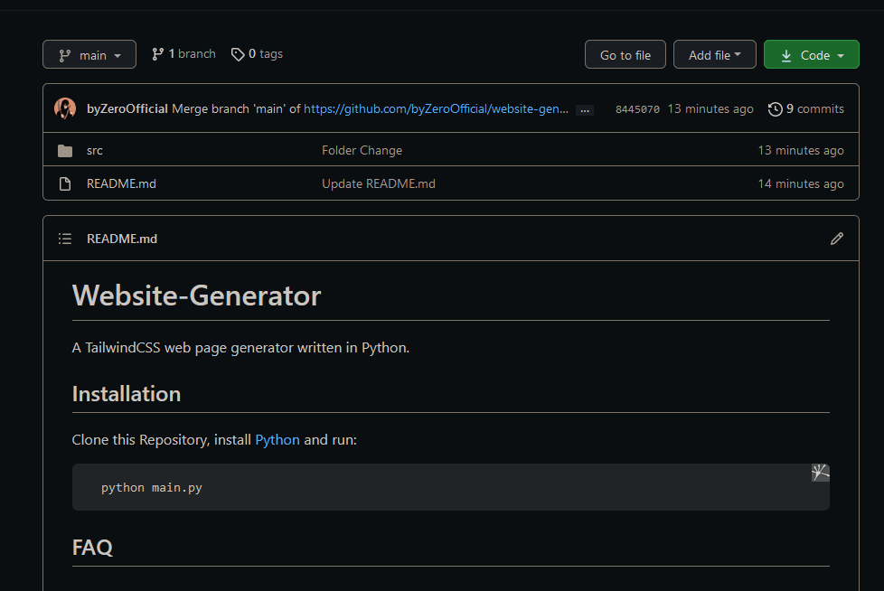
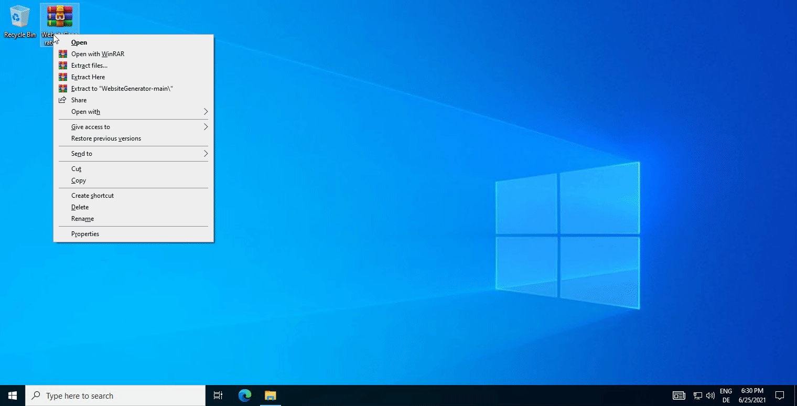
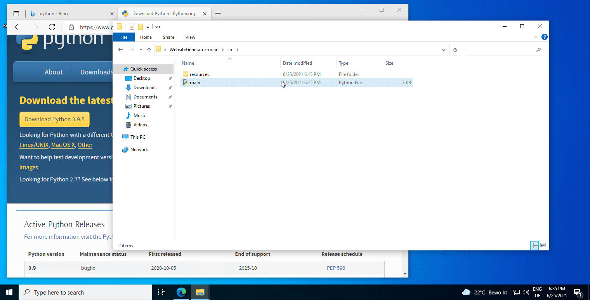

# 2. Clone and Run

If you are not well versed with GitHub, I recommend downloading the repository. Here's how to do it:



After that, unzip the Zip with a Software like WinRAR and Open the `/src` Folder



Then, open a Windows Terminal or CMD and type in:&#x20;

```python
python main.py
```

## You can also run it via Direct Python:



